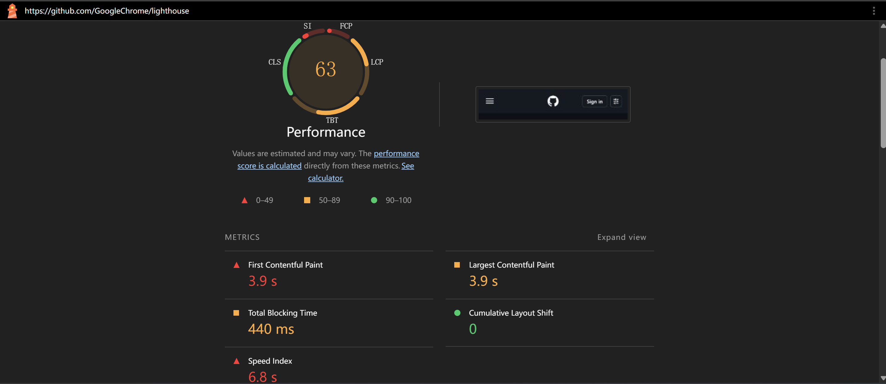

### 结果 (https://github.com/GoogleChrome/lighthouse)

#### CLI

| 指标 | 得分 | 具体数值 |
| ---------------- | ------ | --------- |
| FCP（首次内容绘制） | 0.28 | 3.8s |
| LCP（最大内容绘制） | 0.37 | 4.5s |
| TTI（可交互时间） | 0.06 | 15.8s |
| Speed Index（速度指标） | 0.22 | 7.9s |
| TBT（总阻塞时间） | 0.27 | 1000ms |
| CLS（累积布局偏移） | 1.00 | 0 |

#### DevTools

~~（等等怎么这么低，这不会是我电脑的问题吧）~~
